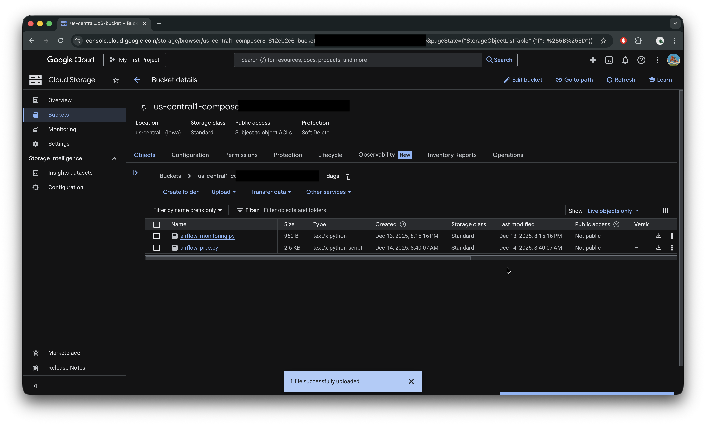
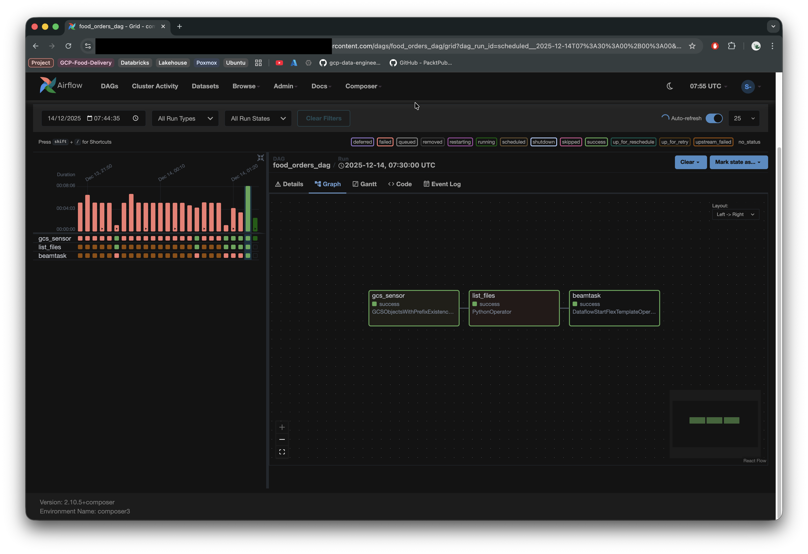
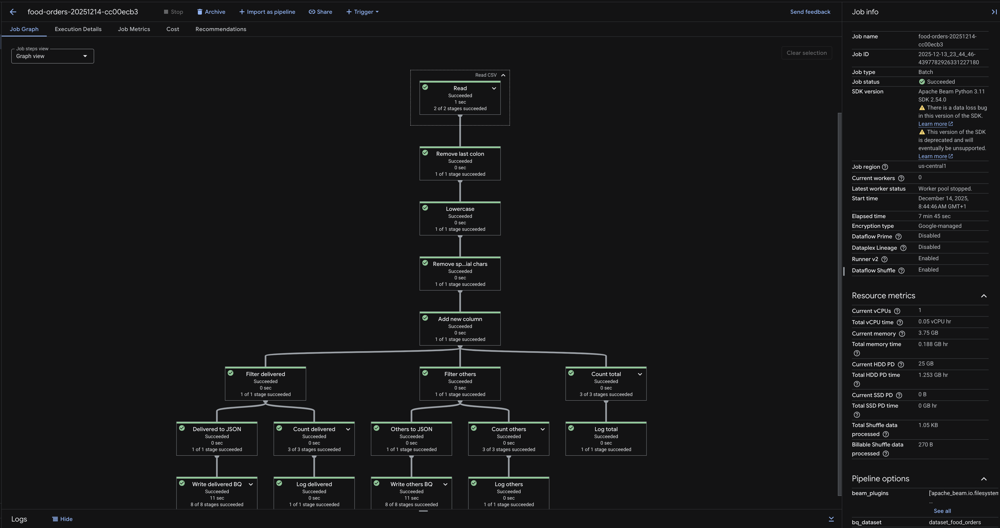
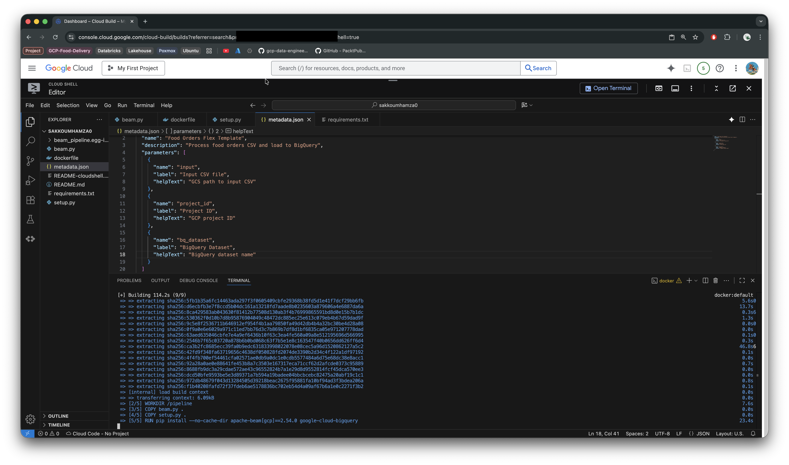
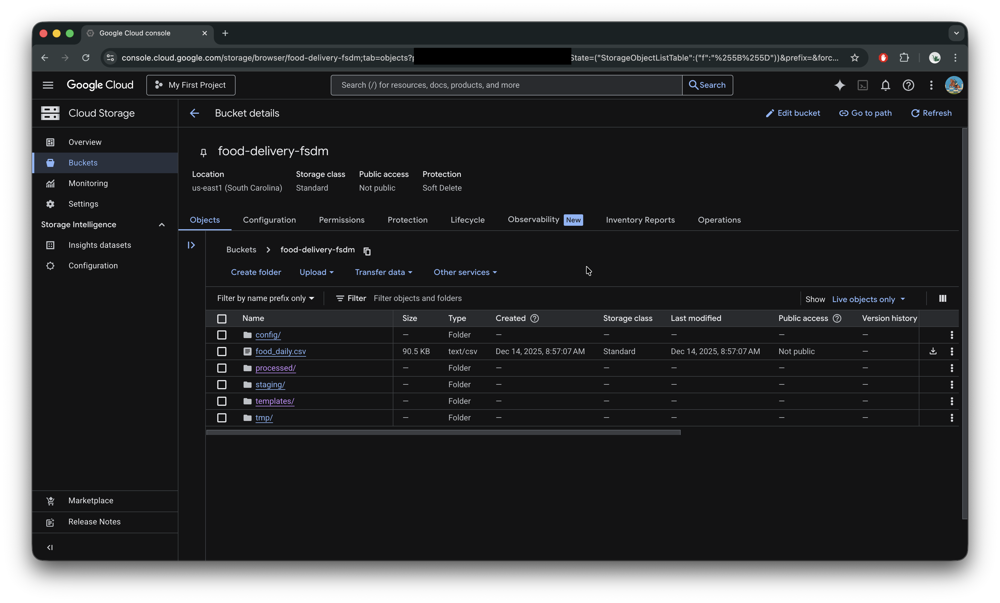
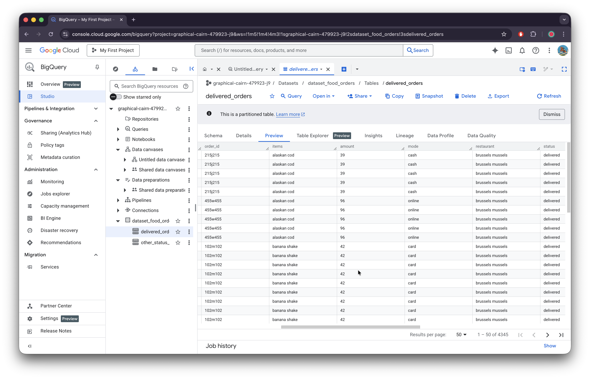

# 🍔 GCP Food Delivery Data Pipeline

> *"When I started building a data pipeline on Google Cloud using Cloud Composer 3, Apache Beam, and Dataflow, I assumed the process would be straightforward. After all, dozens of tutorials show how to run Beam pipelines directly from Airflow. Every single one of them failed."*

## Overview

This project implements a **modern GCP ETL pipeline** using Cloud Composer 3, Apache Beam, and DataFlow with Flex Templates - addressing the challenges that emerged in 2025 when traditional approaches stopped working.

> **What it does**: Processes daily food delivery data, cleaning and transforming it before splitting into separate BigQuery tables based on delivery status. Handles data cleaning, filtering, and partitioned storage for efficient querying.


---

## Table of Contents
- [Overview](#overview)
- [⚠️ Why This Architecture Matters (2025)](#️-why-this-architecture-matters-2025-update)
- [Architecture & Components](#architecture--components)
- [Data Schema](#data-schema)
- [Pipeline Workflow](#pipeline-workflow)
- [Configuration](#configuration)
- [Usage](#usage)
- [Output](#output)
- [Best Practices](#best-practices-summary-composer-3)

---

## ⚠️ Why This Architecture Matters 

### Cloud Composer 3 Changed the Rules

> 💡 Traditional data pipeline approaches that worked perfectly in older versions of Cloud Composer are now completely broken in Composer 3.

Cloud Composer 3 introduces strict architectural constraints:

- Runs on **GKE (Google Kubernetes Engine) Autopilot**
- Uses **immutable Airflow worker images**
- **No system-level package installation**
- **You cannot run Apache Beam directly inside Airflow anymore**
- **Legacy Dataflow/Beam operators are removed**

> 🆘 The following approaches will **fail** in Composer 3:
- Importing Apache Beam inside a DAG
- Installing `apache-beam[gcp]` via requirements.txt
- Using deprecated operators:
  - `DataflowStartPythonJobOperator`
  - `BeamRunPythonPipelineOperator`
  - `DataFlowCreatePythonJobOperator`
- Executing Beam logic inside Airflow tasks

### ✅ The New Architecture

> **Solution**: Treat Airflow as orchestration only

**Separation of Concerns:**
- **Airflow**: Watches for files, passes parameters, triggers jobs
- **Dataflow**: Runs Apache Beam, scales independently, owns execution

This is achieved using **Dataflow Flex Templates**.


---

## Architecture & Components

### Overall System Architecture


**Pipeline Layers:**
- **Source Layer**: Food delivery CSV files arrives in Google Cloud Storage buckets
- **Orchestration Layer**: Cloud Composer 3 (Airflow managed service) managing workflow triggers and scheduling  
- **Processing Layer**: Apache Beam pipeline running on Google Dataflow via Flex Templates
- **Storage Layer**: Processed data partitioned into BigQuery tables for analytics
- **Data Flow**: Automated ETL process from raw CSV ingestion through data cleaning, transformation, and final storage with proper error handling and monitoring capabilities

---

### Orchestration & Workflow Management



*Cloud Composer bucket structure showing DAG files and dependencies*


*Airflow DAG execution showing the three-step pipeline: **sensor** → **file processing** → **dataflow job***

---

### Processing & Deployment



*Google DataFlow job execution showing the Beam pipeline running on managed infrastructure*


*Docker container build process for the Flex Template deployment*

---

### Data Storage & Results



*GCS bucket containing the source food delivery CSV files*


*BigQuery table showing successfully delivered orders with partitioning*


*BigQuery table for orders with non-delivered status (cancelled, pending, etc.)*

---

### Key Components


1. **Docker Container**: Contains Apache Beam pipeline with all dependencies
2. **Flex Template JSON**: Defines parameters and Docker image location  
3. **Airflow DAG**: Orchestrates file detection and job triggering
4. **BigQuery Tables**: Partitioned storage for efficient analytics

---


> **Data Structure**: Rich food delivery order information with customer feedback


| Customer_id | Date | Time | Order_id | Items | Amount | Mode | Restaurant | Status | Ratings | Feedback |
|-------------|------|------|----------|--------|--------|------|------------|--------|---------|----------|
| JXJY167254JK | 11/10/2023 | 8.31.21 | 654S654 | PiZza:Marga?ritA:WATERZOOI:Crispy Onion Rings | 21 | Wallet | Brussels Mussels | Delivered | 2 | Late delivery |

---

## Pipeline Workflow


The pipeline follows these automated steps:

1. **File Detection**: GCS sensor waits for new food delivery CSV files
2. **File Processing**: Latest file is moved to `processed/` folder 
3. **Data Cleaning**: 
   - Removes trailing colons from items field
   - Converts text to lowercase
   - Removes special characters (?%&)
   - Adds a new tracking column
4. **Data Filtering**: Separates orders by delivery status (delivered vs. other)
5. **Data Storage**: Writes to partitioned BigQuery tables via DataFlow

---

## Configuration


Update the configuration in `code/conf.conf`:

```ini
PROJECT_ID=your-gcp-project-id
BQ_DATASET=dataset_food_orders # The name of your BigQuery Dataset
BUCKET_NAME=your-gcs-bucket
IMAGE_NAME=beam-pipeline
VERSION=v1
INPUT_PREFIX=food_daily
PROCESSED_PREFIX=processed/
```

---

## Usage


The pipeline runs automatically **every 10 minutes**, detecting new files and processing them through the complete ETL workflow.

### Automatic Execution
1. **Monitor**: GCS sensor monitors for new CSV files with `food_daily` prefix
2. **Process**: When detected, file is automatically moved to `processed/` folder
3. **Execute**: Dataflow job launches via Flex Template
4. **Store**: Data is cleaned, transformed, and loaded to BigQuery

---

## Output

The pipeline creates **two BigQuery tables**:
- **`delivered_orders`**: Orders with "delivered" status
- **`other_status_orders`**: Orders with other statuses (pending, cancelled, etc.)

Both tables are **partitioned by day** for optimal query performance and cost efficiency.

---

> 💡 **Final Takeaway**: *"The key to success with Cloud Composer 3 is embracing the new paradigm: containerized processing with proper separation of concerns."*