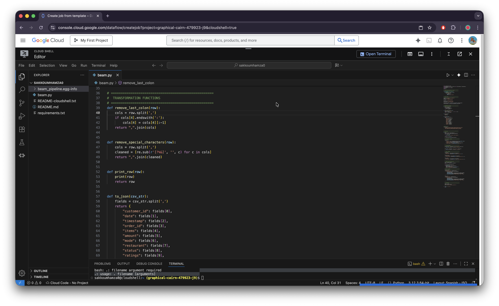

# 🍔 GCP Food Delivery Data Pipeline

> ⚠️ **Work in Progress**: This project is currently under development and not yet complete.

A Google Cloud Platform data processing pipeline using Apache Beam to process food delivery order data and store it in BigQuery for analytics.

## Overview

This project processes daily food delivery data using Apache Beam, cleaning and transforming the data before splitting it into separate BigQuery tables based on delivery status. The pipeline handles data cleaning, filtering, and partitioned storage for efficient querying.

## Data Schema

The pipeline processes food delivery orders with the following fields:
- Customer ID, Date, Timestamp, Order ID
- Items ordered, Amount, Payment mode, Restaurant
- Delivery status, Ratings, Customer feedback

### Sample Data

| Customer_id | Date | Time | Order_id | Items | Amount | Mode | Restaurant | Status | Ratings | Feedback |
|-------------|------|------|----------|--------|--------|------|------------|--------|---------|----------|
| JXJY167254JK | 11/10/2023 | 8.31.21 | 654S654 | PiZza:Marga?ritA:WATERZOOI:Crispy Onion Rings | 21 | Wallet | Brussels Mussels | Delivered | 2 | Late delivery |

## Architecture



The pipeline follows these steps:
1. **Data Ingestion**: Reads CSV files from Google Cloud Storage
2. **Data Cleaning**: 
   - Removes trailing colons from items field
   - Converts text to lowercase
   - Removes special characters (?%&)
   - Adds a new tracking column
3. **Data Filtering**: Separates orders by delivery status
4. **Data Storage**: Writes to partitioned BigQuery tables

## BigQuery Tables

### Delivered Orders Table


### Other Status Orders Table  


## Pipeline Features

- **Data Validation**: Automatic schema validation and error handling
- **Partitioned Storage**: Day-based partitioning for efficient querying
- **Duplicate Handling**: Write append mode for incremental data loads
- **Monitoring**: Built-in count logging for data quality checks
- **Auto-provisioning**: Automatic BigQuery dataset creation

## Configuration

Before running, update the global configurations in `beam.py`:

```python
project_id = "your-gcp-project-id"
region = "your-region"
gcs_bucket = "your-gcs-bucket"
bq_dataset = "your-bigquery-dataset"
```

## Usage

Run the pipeline with:

```bash
python beam.py --input gs://your-bucket/food_daily.csv
```

## Output

The pipeline creates two BigQuery tables:
- `delivered_orders`: Orders with "delivered" status
- `other_status_orders`: Orders with other statuses (pending, cancelled, etc.)

Both tables are partitioned by day for optimal query performance and cost efficiency.